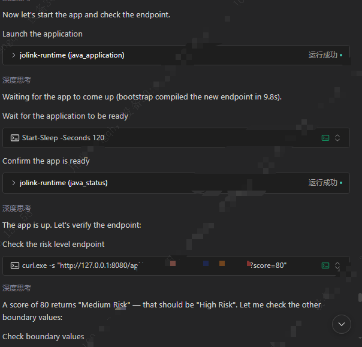
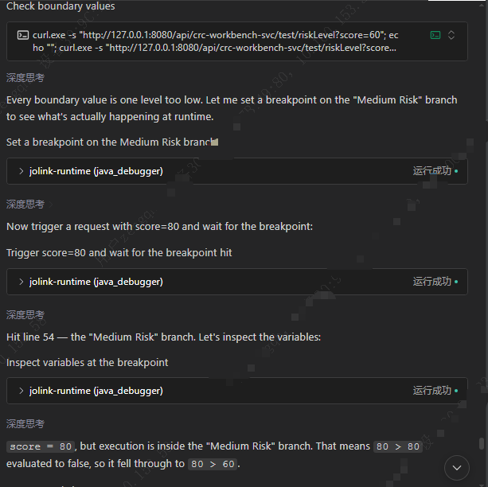

# joLink Runtime

<!-- mcp-name: io.github.L1ch404/jolink-runtime -->

English | [简体中文](README.zh-CN.md)

**A lightweight, headless Java IDE for AI coding agents.**

Closing the loop for autonomous Java development.

> **Design principle:** Everything exists to reduce uncertainty for the LLM.

joLink does not provide an editor UI. Instead, it exposes incremental compilation,
testing, application startup and breakpoint debugging through MCP to the coding
agent you already use—so it can run the code, inspect real state, and verify its
own changes.

Persistent compilation state and HotSwap reduce repeated full rebuilds and JVM
restarts. When tests, logs and endpoint responses are not enough, the agent can
use breakpoints and inspect exception events, stack frames and variables.

Free and local. It does not require a joLink account, model API key, inference
provider, or separate agent application.

## Install

1. Open a **new chat** in your coding agent.
2. Click the copy button in the code block below, paste the entire prompt into that chat, and send it.

```text
Follow this guide:
https://github.com/L1ch404/jolink-runtime/blob/main/INSTALL.md
Install joLink MCP and its English Skill for my current agent.
Use user-level installation by default and preserve existing configuration.
Check the saved configuration and Skill file. If this chat cannot load the new MCP or Skill,
stop and tell me how to reload the client; leave connection verification to a chat after reloading.
```

3. If the agent reports that a reload is needed, reconnect MCP or restart the client
   as instructed, then open a new chat. Configuration complete but not yet loaded
   is not an installation failure. In the loaded chat, you can send:

```text
Verify the existing joLink MCP and jolink-java Skill in this client without reinstalling them.
Call the joLink status tool exposed by this client once, and check its Skill list or loading facility.
If either is still unavailable, report what is missing and stop; do not write a standalone verification script.
Do not start applications or run tests.
```

The guide provides official client-specific locations and examples for Codex,
Claude Code, Cursor, VS Code/Copilot, CodeBuddy, Gemini CLI, OpenCode, Cline,
Roo Code and Windsurf. All start MCP with `uvx jolink-runtime@latest` and use the same
[English Skill](skills/jolink-java/SKILL.md); no plugin bundle or universal installer
is required. MCP performs the work; the Skill helps the agent discover and use it.
The guide also covers uv setup, preserving configuration, reconnection and verification.

For Chinese instructions, use [the Chinese installation guide](https://github.com/L1ch404/jolink-runtime/blob/main/INSTALL.zh-CN.md).

## Why joLink

Coding agents are good at reading and changing code, but they can become stuck
in a loop of static assumptions:

```text
analyze
-> patch
-> assume the patch works
-> patch again
```

joLink adds the missing runtime feedback loop:

```text
analyze
-> change
-> run
-> observe
-> update the hypothesis
-> change again if necessary
```

This is useful when:

- the Java application is not running yet;
- a code change needs to be verified against real behavior;
- repeated patches have not solved the problem;
- endpoint results do not match the source-code interpretation;
- logs or tests are insufficient to explain the executed path;
- business naming is inconsistent and static search cannot find the relevant
  code;
- deeper runtime evidence such as breakpoints, stacks, or variables is needed.

The goal is not to use a debugger for every problem.

Start with the cheapest useful evidence:

```text
application status
-> logs and actual outputs
-> exception events
-> executed path
-> breakpoints, stack frames, and variables
```

Debug deeper only when necessary.

## What it can do

joLink exposes four focused MCP tools:

- `java_application` — project launch, compile-aware restart (HotSwap by default),
  stop, and attach;
- `java_fast_test` — selected Java tests, result details and cancellation, without an application launch;
- `java_status` — Java process discovery, compact status, on-demand details and logs;
- `java_debugger` — breakpoints, exception events, stacks, variables, and resume.

After editing a managed project, call `java_application(action=restart)`.
It incrementally compiles changes in the existing JDT workspace and prefers
HotSwap; incompatible changes restart the JVM using those same compiled outputs.
Set `hotswap=false` to force process/application reinitialization. The result's
`apply_method` distinguishes HotSwap from a real restart. See
[restart workflow](docs/project-restart.zh-CN.md).

Fast Test uses a Maven or Gradle Probe only when its small configuration cache
is absent or changed. The exported test Build World and JDT workspace persist
across MCP processes. JDT keeps main and test classes current and runs
explicit JUnit 4/5 or TestNG tests in an isolated JVM:

```text
java_fast_test(action=run,
  project_path=/path/to/project,
  source_files=[src/main/java/example/Service.java],
  tests=[example.ServiceTest#works], timeout=60)
-> if unfinished, choose a suitable waiting interval, then call java_status(action=status)
-> read diagnostics/failures with java_fast_test(action=result, test_run_id=...)
-> cancel with java_fast_test(action=cancel, test_run_id=...)
```

`java_status(status).fast_test` stays compact. If compilation fails before `run`
returns, its reply includes compiler diagnostics directly. Errors that occur after
a timeout reply and failed-test details are available through `result`; follow
the summary's `next_action` or use its `test_run_id`, without rerunning tests.
Full compiler file lists are omitted. Only the active
and most recently completed test attempts are retained in the current MCP session;
an unavailable ID returns `TEST_RUN_NOT_FOUND`.

`passed=false` means the selected tests executed and found a failure; it is not
a Tool infrastructure error. Fast Test does not require or modify a running
application. The current JDT supports Java 8 through 26 source/target levels;
product regression covers 8, 11, 17 and 21, including separate main/test levels.
Target libraries and application/test JDKs still follow the project. Supported
build layouts include Maven jar projects, one
explicitly selected jar module in a standard Reactor, and Gradle Java builds
including multi-Project dependencies (tested with 7.4.2, 8.10 and 8.14).
Maven and Gradle multi-module launch and Fast Test resolve the selected
module's upstream dependencies into separate JDT projects in one Worker.
Unchanged modules reuse their output; JavaBuilder propagates changed APIs and
constants to affected downstream sources. Local module dependencies use current
workspace output rather than installed JARs; Maven also supports test-jar
dependencies. See [Gradle multi-module flow and evidence](docs/gradle-modules.zh-CN.md).


## Demo

**From an unexpected API response to runtime investigation.**

Reading source code tells an agent what might happen. Running the application
and inspecting its state helps the agent check what actually happens.

The screenshots below show a debugging example: an agent starts a Java
application, checks an endpoint, notices an unexpected result, and uses
joLink to investigate the execution path.

> This is a constructed demonstration scenario, not a record of an actual business incident.
> Some sensitive information in the screenshots has been redacted for privacy.

### 1. Start the application and check the actual response

The agent uses `java_application` to launch the application and `java_status`
to check its state, then sends an HTTP request to a sample risk-scoring endpoint.

For `score=80`, the expected category is `High Risk`, but the agent reports
`Medium Risk`. It checks additional boundary values before investigating further.



### 2. Set a breakpoint and inspect runtime variables

The agent uses `java_debugger` to set a breakpoint on the `Medium Risk` branch,
triggers another request, and inspects the variables after the breakpoint is hit.

The conversation shows `score=80` while execution is in the `Medium Risk`
branch. This gives the agent runtime evidence to investigate its
boundary-condition hypothesis, rather than relying only on source-code assumptions.



This example demonstrates application startup and runtime investigation.
It is not a Fast Test performance benchmark; the screenshots cover the
investigation stage, not the subsequent fix and re-verification.

## Private diagnostics

joLink keeps stdout exclusively for MCP JSON-RPC. Python lifecycle logs and
tracebacks are also written to a bounded private rotating file:

```text
Windows: %LOCALAPPDATA%\jolink-runtime\logs\mcp.log
macOS/Linux: $XDG_CACHE_HOME/jolink-runtime/logs/mcp.log
               or ~/.cache/jolink-runtime/logs/mcp.log
```

`status` does not return `mcp.log` paths or logging configuration, even with `details=true`.
Read the local file at the path above when diagnosing joLink itself. A diagnostic-file
failure never prevents the MCP server from starting. The file is limited to
4 MiB with three rotated backups; stdout remains untouched.

`java_status(action=status)` is a compact overview: readiness, process/debug state,
active operation and recent restart/Test summaries. Read `java_status(action=status, details=true)`
for current launch errors, full `last_reload`, compiler/cache settings and timings.
Completed `launch/restart` calls already return their own detailed result; the
flag is useful when an operation continued after the synchronous reply timeout.
Neither call reads or embeds build logs. Use `java_status(action=logs, source=build)`
for the current launch's build log, or omit `source` to read application output;
both accept `tail`. Restart summaries include a `next_action` pointing to details.

`launch/restart` replies include `previous_startup_ms`: the prior successful JVM
startup duration saved locally for the same launch, captured before
the new operation. It excludes Probe/JDT compilation. With `ready_port` it
measures startup through observed TCP readiness; otherwise it only measures JVM/
JDWP startup. HotSwap and failed startups do not replace this observation.
It is written once when startup succeeds to a small JSON file under the joLink
cache's `startup-timings/` directory. Stop, a new conversation or an MCP restart
does not discard it. The next launch reads that file; no expiry, build-input
validation or repeated status writes are involved. An unseen launch returns
`null`. Treat it as a waiting reference, not a prediction or a readiness check.

Set `JOLINK_LOG_LEVEL` in the MCP server's environment and restart it:
`WARNING` (default) keeps warnings/errors only; `INFO` records JDT
cache/source/build/save summaries and native FULL fallback reasons;
`DEBUG` also retains detailed Worker output; `ERROR` keeps errors only;
`OFF` disables joLink diagnostic logging. Application logs and tool results are
unaffected. The Worker uses a fixed incremental propagation limit of 10 rounds.
See [JDT build diagnostics](docs/jdt-build-diagnostics.zh-CN.md).

The public actions are:

```text
launch
stop
restart
attach
detach
breakpoint
exception
wait_event
threads
stack
variables
resume
cleanup_debug_state
processes / status / logs
```

These actions support:

- launching a Java application as an owned JVM process;
- launching a Maven/Gradle project with `project_path` and `main_class`, or
  optionally importing an IntelliJ IDEA Application/Spring Boot configuration,
  exporting its Build World without running Maven/Gradle compilation, compiling
  with JDT before JVM startup, and launching without packaging a fat JAR;
- stopping or restarting an application after code changes;
- compiling detected edits in a persistent private JDT session and applying
  compatible loaded class definitions with HotSwap;
- inspecting application status and logs;
- attaching to an already-running local JVM;
- setting semantic breakpoints and exception watches;
- waiting for runtime events;
- inspecting threads, stack frames, and variables;
- resuming suspended execution;
- cleaning up debug state safely.

## Current status

Current package version:

```text
0.1.0a7
```

Status:

```text
Alpha / controlled dogfood
```

The first adapter targets local Java applications through JDWP.

The current MCP implementation includes:

- stdio transport;
- stdout reserved exclusively for MCP protocol messages;
- JSON `TextContent` with matching `structuredContent`;
- Runtime `ok=false` mapped to MCP `isError=true`;
- cancellable `wait_event`;
- optional two-phase waiting with `arm` and `await`;
- an optional loopback HTTP trigger started only after JDWP is armed, with a
  one-call `blocking` shortcut or explicit `arm`/`await`;
- wait-scoped JDWP requests;
- ownership-aware shutdown;
- automatic cleanup and resume paths;
- persistent JDWP packet framing across short polling timeouts.

The current two-phase implementation is intended for controlled dogfood.
Known cancellation, cleanup-preemption, handle-publication, and response
delivery limitations are tracked in:

[`docs/stage-2.1.2-lifecycle-backlog.md`](docs/archive/stage-2.1.2-lifecycle-backlog.md)

Do not use this alpha release for unattended production JVM debugging.

## Requirements

- JDK 8 or newer
- [uv](https://docs.astral.sh/uv/)

`uv` manages the Python environment automatically. A separate Python
installation is normally not required.

Confirm the requirements with:

```bash
java -version
uv --version
```

## Quick start

After the MCP server is connected, confirm that these tools are available:

```text
java_application
java_fast_test
java_status
java_debugger
```

Open a local Java project and ask the coding agent:

```text
Use joLink to start this Java application, inspect its status and logs,
and verify the latest code changes against real runtime behavior.
```

For a problem that has already survived multiple attempted fixes:

```text
Do not apply another speculative patch yet.

Use joLink to run the current Java application and collect actual runtime
evidence. Start with status, logs, tests, and actual outputs. Re-evaluate the
root-cause hypothesis before changing the code again.
```

For deeper investigation:

```text
Use joLink to reproduce this issue.

Start with actual outputs and logs. If that evidence is insufficient, use a
breakpoint or exception watch, inspect the relevant stack frames and variables,
then resume or clean up the suspended JVM.
```

joLink starts and observes the Java application. The coding agent may use its
normal HTTP, terminal, browser, or testing tools to trigger the scenario.

For a method-body edit in an application launched with `project_path`, the
agent can avoid a full Maven rebuild/restart:

```text
java_status(action=status; confirm runtime_active and compile_ready=true)
-> java_application(action=restart)
-> if still running, java_status(action=status; observe last_reload)
-> trigger a fresh request
-> verify the new runtime behavior
```

`restart` automatically detects and incrementally compiles source changes, then
uses HotSwap by default. Deleted/unloaded classes, generated resource changes or
explicit JVM rejection select a real restart using those already compiled outputs.
`hotswap=false` forces process reinitialization. No pending code changes restart
without compiling. Compilation errors leave the old process running. Lost
HotSwap replies remain unknown rather than being mistaken for explicit rejection.
The call waits up to `timeout` (maximum 30 seconds); if unfinished, it returns
`restart_started` plus the existing `reload_id`, observable through
`active_operation` and `last_reload`. `apply_method` distinguishes HotSwap from
process restart. Completed builds immediately save JDT state and source indexes
in the local persistent workspace. There are no extra class-output copies.
HotSwap does not rerun initialization or refresh Spring metadata; verify with a
fresh request. Breakpoints in redefined classes become stale and must be reset.

The locked JDT Worker is installed into a content-addressed user cache on
first use. Valid Eclipse bundles are reused from older joLink caches; missing
bundles are downloaded and verified, while the product Worker and Equinox
configuration ship inside the Python package. A changed build configuration or
unavailable session refreshes via the existing project launch path. Use
`restart(hotswap=false)` when startup/framework state must be recreated.

The product uses Eclipse 4.40 / JDT 3.46 with matching APT bundles. Its Worker
targets Java 17 bytecode and defaults to a private, pinned Temurin 21 runtime,
installed once in the user cache. Maven/Gradle and application/test JVMs keep
their project JDKs. `JOLINK_WORKER_JAVA_HOME` can select a corporate-provided
64-bit JDK 17+ instead. Old Lombok 1.18.20 compatibility issues remain recorded,
not silently fixed by replacing project dependencies. See
[JDT 3.46 and private Worker JDK](docs/jdt-346-upgrade.zh-CN.md) for offline setup
and actual compatibility results.

First-time JDK/Eclipse downloads use their pinned official URLs by default.
Set `JOLINK_DOWNLOAD_MIRROR=cn` to try TUNA, then the joLink mirror at
`https://7355608.net/jolink/assets`, then upstream on connection/transfer failure.
A custom mirror base URL uses that mirror followed by upstream; `official`
(or an empty value) uses upstream only. No IP/geolocation detection is performed.
Existing SHA256 checks and installed caches are unaffected. TUNA access was
blocked during local verification; selecting `cn` does not guarantee its availability.
See [runtime mirror setup](docs/runtime-download-mirror.zh-CN.md).

The imported IDEA Make/Build flag does not cause Maven or Gradle compilation.
On the first launch, the Probe exports compiler/runtime facts and JDT performs
FULL compilation. Later launches reuse the persisted Probe model and use saved
source size/mtime to detect edits. Changes to tracked Maven/Gradle configuration
refresh the model. Untracked external scripts and hidden inputs remain recorded
in the [compatibility follow-up](docs/java-compatibility-followup-2026-09.md);
cache deletion is not a routine startup or installation step.

See [JDT-first startup](docs/jdt-first-launch.zh-CN.md) for the current
single-module startup and cache behavior.

## Typical workflow

A normal verification flow looks like this:

```text
read the code
-> change the code
-> java_application(launch or restart, ready_port=<application port>)
-> if startup_state=starting, call java_status(status) until ready
-> if startup_state=failed, inspect java_status(logs)
-> trigger a test or endpoint
-> inspect the actual result
-> update the diagnosis
```

A deeper debugging flow looks like this:

```text
run or attach
-> for an owned HTTP application, confirm startup_state=ready
-> configure a breakpoint or exception watch
-> for a managed local HTTP request:
   wait_event(wait_mode=blocking, http_trigger=...)
-> otherwise:
   wait_event(wait_mode=arm)
   -> trigger the scenario after status=armed
   -> wait_event(wait_mode=await, wait_handle=...)
-> inspect stack frames and variables
-> resume or cleanup_debug_state
```

For a local HTTP endpoint, `blocking` composes the existing
`arm -> trigger -> await` lifecycle into one call:

```json
{
  "action": "wait_event",
  "wait_mode": "blocking",
  "timeout": 30,
  "http_trigger": {
    "method": "POST",
    "url": "http://127.0.0.1:8080/example",
    "json_body": {"id": 1},
    "timeout_seconds": 30
  }
}
```

Use explicit `arm` followed by `await` when an external action must occur
between arming and observation. A terminal result consumes its `wait_handle`;
the handle observes Runtime events and is not an HTTP-response handle.

For an HTTP application launched by joLink, distinguish process/debugger
startup from application TCP readiness:

```json
{
  "action": "launch",
  "jar_path": "target/app.jar",
  "jdwp_port": 5005,
  "ready_port": 8080,
  "timeout": 30
}
```

For `java_application(launch/restart)` and `java_fast_test`, `timeout` limits the synchronous result wait, including
runtime preparation and compilation. It defaults to 30 seconds; larger values
are accepted but wait only 30 seconds. Zero returns after task submission.
The original task continues after this reply deadline. Test Runner execution
has a separate internal 300-second limit; `timeout` no longer configures it.
If still running, choose a waiting interval appropriate to the stage (for
example using sleep or PowerShell Start-Sleep), then query `java_status`.
Do not rapidly poll or resubmit the task. The old readiness-wait argument has
been removed, not retained as an alias.
Direct JAR/classpath launches still perform their existing process creation
and JDWP handshake before returning a task observation. `timeout=0` skips the
additional readiness wait; it does not make that initial handshake asynchronous.
If the process is alive but the application port is not accepting connections,
the result remains successful with `startup_state=starting`; the process is
kept alive and `next_action=status`. Each later `status` call probes the stored
port again. `startup_state=ready` means only that the configured loopback TCP
port accepted a connection; it does not prove that every dependency, cache, or
business endpoint is healthy.

When `ready_port` is omitted, joLink reports `startup_state=unverified` rather
than claiming application readiness. An HTTP trigger remains allowed for
attached and otherwise unverified JVMs, but its result includes a warning.
When configured readiness is still `starting`, joLink rejects an HTTP trigger
without sending it.

## Runtime safety

joLink `0.1.0a7` is designed for local, trusted development environments.

Current safety boundaries:

- MCP transport is stdio;
- JDWP access is limited to local JVMs;
- one joLink server controls one Java target at a time;
- a JVM launched by joLink is treated as an owned process;
- an owned JVM may be stopped by joLink;
- an externally started JVM is attached, resumed, and detached;
- an attached JVM is never intentionally terminated;
- raw JDWP requests are armed only while a waiter owns them; logical
  breakpoint and exception definitions persist until removed or cleaned up;
- built-in HTTP triggers accept only `http://127.0.0.1`, do not use environment
  proxies or redirects, and never return the request URL, headers, body, or
  their raw values in validation errors;
- a configured `ready_port` must be unused before launch and must differ from
  the JDWP port; the TCP probe is local and does not send an application
  request;
- `response_headers_received` reports only the HTTP status/response headers;
  joLink does not read or return the response body;
- cancelling an HTTP client wait closes joLink's side of the connection but
  cannot guarantee that server-side business work has been undone;
- successful `cleanup_debug_state` includes its own debug-state verification;
  a separate HTTP cleanup state may remain `settling` without delaying JVM
  cleanup;
- after receiving a `suspension_id`, the agent must call `resume` or
  `cleanup_debug_state`.

Do not expose the JDWP port to an untrusted network.

Do not use the current alpha release for remote or production debugging.

## Client notes

### CodeBuddy

Some current CodeBuddy environments may initially display:

```text
Description: No description
```

Use the host's tool-definition loading/search facility to obtain the actual schema.
Do not infer arguments from a tool name alone. The independently installed
`jolink-java` Skill provides a discovery and workflow entry point; it does not
replace the MCP connection or guarantee tool selection. Follow the
[installation guide](https://github.com/L1ch404/jolink-runtime/blob/main/INSTALL.md) for the specific CodeBuddy surface (CLI, IDE or
editor plugin), rather than assuming their configuration files are interchangeable.

## Development

Clone the repository and install development dependencies:

```bash
uv sync --extra dev --locked
```

Run the default test suite:

```bash
uv run pytest
```

Run the stdio server from the source checkout:

```bash
uv run jolink-runtime
```

Equivalent module entry point:

```bash
uv run python -m jolink_runtime.transport.stdio
```

A generic MCP client configuration can launch it directly from a checkout:

```json
{
  "mcpServers": {
    "jolink-runtime": {
      "command": "uv",
      "args": [
        "--directory",
        "/absolute/path/to/jolink-runtime",
        "run",
        "jolink-runtime"
      ]
    }
  }
}
```

## Tests

After changing joLink source, do not kill an MCP server and assume an existing
host tool handle will reconnect. Start a fresh server from the current
worktree through the real stdio protocol:

```bash
uv run python scripts/jolink_mcp_dev_client.py
```

The client prints the Git commit, dirty-worktree state, source fingerprint,
Python executable, and stderr path before accepting JSONL `tools/call`
requests. Send `{"command":"quit"}` to close the client and trigger normal
server cleanup. This is the canonical interactive verification path for
uncommitted code; a Codex/IDE MCP connection should be established only after
the code under test is frozen.

The real subprocess acceptance test exercises the MCP stdio boundary:

```bash
uv run pytest -q tests/e2e/test_stdio_mcp.py
```

It performs:

```text
initialize
-> tools/list
-> java_status(status)
-> close the stdio client
-> wait for the server process to exit
```

The heavier real MCP/JVM suite is opt-in locally:

```bash
JOLINK_RUN_MCP_JAVA_E2E=1 \
  uv run pytest -q -m mcp_java_e2e tests/e2e/test_stdio_mcp_java.py
```

The managed Temurin 21 Worker and Java 8 application lifecycle have standalone
deep validators (Worker JDK and application/target JDK are different roles):

```bash
uv run python scripts/validate_jdt_worker_matrix.py \
  --target-java-home <jdk8> \
  --worker-java-home <jdk21>

uv run python scripts/validate_jdt8_product_mcp.py \
  --jdk8-home <jdk8> \
  --maven-home <maven-home>

JOLINK_RUN_FAST_TEST_E2E=1 \
JOLINK_FAST_TEST_JAVA8_HOME=<jdk8> \
  uv run pytest -q -m fast_test_e2e \
  tests/e2e/test_fast_test_product.py

uv run python scripts/validate_fast_test_build_jdk_matrix.py \
  --target-java8-home <jdk8> \
  --build-java-home <jdk8> \
  --build-java-home <jdk11> \
  --build-java-home <jdk17>

uv run python scripts/build_jdt_worker_release.py \
  --java-home <jdk8> \
  --maven <maven-executable> \
  --gradle <gradle-executable>
```

The canonical CI environment for the heavier suite is:

```text
Linux
Python 3.11
Application/target JDK 8/11/17/21; managed Worker JDK 21
```

## Contracts

See [current documentation](docs/README.md), [product Java sources and builds](java/README.md),
and [historical research records](docs/archive/README.md). Archived experiment
commands and limits are not the current product interface.

- MCP v0.1:
  [`docs/mcp-contract-v0.1.md`](docs/mcp-contract-v0.1.md)
- Runtime lineage 2.4.0:
  [`docs/runtime-lineage-contract-2.4.0.md`](docs/runtime-lineage-contract-2.4.0.md)

## License

joLink's own code is [MIT-licensed](LICENSE). Downloaded Eclipse/Temurin runtimes
and installed Python dependencies retain their own licenses. See
[third-party notices and corresponding sources](THIRD_PARTY_NOTICES.md).
Offline runtime kits must be accompanied by the matching source kit and notices.
