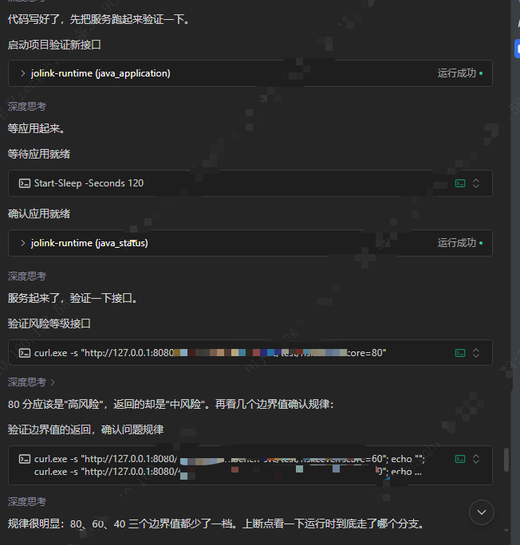

# joLink Runtime

[English](README.md) | 简体中文

**专为 AI 编程 Agent 打造的轻量级 Java IDE。**

为自主 Java 开发补齐运行验证闭环。

> 第一原则：通过真实运行减少不确定性。

joLink 不提供编辑器界面，而是通过 MCP，将增量编译、测试、应用运行和断点调试能力
交给你现有的 Agent，让它不只修改代码，还能运行程序、检查真实状态，并验证自己的修改。

修改后复用编译状态，通过增量编译和 HotSwap 减少重复全量编译与重启的等待。
当测试、日志和接口响应不足以解释问题时，还可以使用断点、异常事件、调用栈和变量。

免费、本地运行。不需要 joLink 账号、额外模型 API Key 或另外启动一个编程 Agent。
使用你现有的 Agent，通过 MCP 接入；英文 Skill 帮助它发现和使用这些能力。

## 安装

1. 在你使用的编程 Agent 中**新开一个对话窗口**。
2. 点击下方代码块右上角的复制按钮，将整段提示词粘贴到对话框中并发送。

```text
按照这份文档：
https://github.com/L1ch404/jolink-runtime/blob/main/INSTALL.zh-CN.md
为我当前使用的 Agent 安装 joLink MCP 和英文 Skill。
默认用户级安装，保留现有配置，并验证连接。
```

安装文档覆盖 Codex、Claude Code、Cursor、VS Code/Copilot、CodeBuddy、Gemini CLI、
OpenCode、Cline、Roo Code、Windsurf 等客户端的官方接入方式。MCP 和 Skill 分开安装，
所有客户端通过 `uvx jolink-runtime@latest` 启动 MCP，并使用同一份
[英文 Skill](skills/jolink-java/SKILL.md)。

## 为什么需要 joLink

读懂源码不等于知道它实际如何运行。joLink 希望把开发循环变成：

```text
修改代码 → 增量编译 → 测试/启动 → 观察实际行为 → 继续修改
```

适合的场景包括：反复修改 Java 后验证测试、应用启动缓慢而希望保留编译状态、接口行为
和源码推断不一致，以及需要运行时证据来定位问题。

不要求每个问题都使用调试器。先选择最便宜且有用的证据：所选测试、应用状态、日志或
实际响应；需要时再检查断点、异常、调用栈和变量。

## 四个 MCP 工具

| 工具 | 用途 |
|---|---|
| `java_fast_test` | 运行所选 Java 测试、读取结果详情、取消任务；不要求先启动业务应用 |
| `java_application` | 启动、增量编译后 HotSwap/重启、停止、attach/detach |
| `java_status` | 查看进程、精简状态、按需详情和日志 |
| `java_debugger` | 断点、异常监听、等待事件、调用栈、变量、恢复执行 |

工具描述和参数 schema 是当前接口依据；宿主可能给工具名添加 MCP 服务前缀。

### Fast Test

示例工具：`java_fast_test`，将项目路径和测试选择器替换为实际值：

```json
{
  "action": "run",
  "project_path": "/path/to/project",
  "tests": ["example.ServiceTest#works"]
}
```

`action` 默认 `run`，也可省略。构建系统通过 Probe 导出模型，JDT 维护 main/test 的
编译输出，独立 Test Runner 执行 JUnit 4/5 或 TestNG。它不是 `mvn test` 或
`gradle test` 的简单包装。

冷准备可能需要较长时间；之后复用模型和编译缓存，只处理变化。main/test 的语言级别、
依赖、Processor 和参数分别表达。多模块使用同一个 Worker 管理多个 JDT 工程，
上游变化及依赖传播交给 JavaBuilder，不通过旧本地仓库 JAR 代替工作区输出。

`passed=false` 表示测试运行后发现失败，与编译失败或工具基础设施错误不同。
只报告实际运行的测试，不把所选测试通过等同于整个项目构建通过。

`run` 和 `java_status(status).fast_test` 默认只返回摘要，不附带完整错误诊断、失败堆栈
或编译文件清单。需要详情时，跟随失败结果中的 `next_action`，或调用
`java_fast_test(action="result", test_run_id=...)`，不会重新运行测试。
结果只保留当前 MCP 会话中的活动任务和最近完成任务；已不保留的 ID 返回 `TEST_RUN_NOT_FOUND`。

取消时调用 `java_fast_test(action="cancel", test_run_id=...)`。
详见 [Fast Test 流程与边界](docs/fast-test-v0.1.zh-CN.md)。

### 启动与更新应用

项目启动读取已有 IDEA Application/Spring Boot 启动配置，通过 Maven/Gradle Probe
获得模型，在 JVM 启动前完成必要的 JDT 编译，不要求先打 fat JAR。也支持直接启动
已有 JAR/classpath，或 attach 到本机已有 JVM。

修改受管项目后调用 `java_application`：

```json
{"action":"restart"}
```

restart 自动发现目标和所需上游模块的源码变化，增量编译后优先 HotSwap。不能热更新时，
使用刚编好的产物真正重启，不再编译一次。返回 `apply_method=hotswap/restart` 表示
实际采用的方式。公开 `reload` 已合入该入口。

需要重新初始化应用、重新读取启动/框架配置时：

```json
{"action":"restart","hotswap":false}
```

编译结果和构建状态保存在 JDT workspace，HotSwap 不只是内存中的临时更新。
无源码变化不编译；无待应用的 class 变化时 restart 仍会真实重启 JVM。
普通源码编译失败会返回诊断，不主动停止旧 JVM；构建配置变化或会话不可用时，复用
现有完整 launch 流程，该路径先停止旧实例，不提供 Candidate/rollback。

HotSwap 不重新执行构造器、静态初始化或 Spring 容器启动流程。应用后发起新请求验证，
不能只凭“已应用”宣布业务问题已修复。直接 JAR/classpath 启动没有源码模型，restart
只重启对应产物。详见 [Restart 流程](docs/project-restart.zh-CN.md)。

### 等待与 readiness

launch、restart、Fast Test 的 `timeout` 默认最多等待 30 秒；传入更大的数也只等
30 秒，0 表示提交后立即返回。超过回复预算后原任务继续运行，不等于任务失败。
保留返回的任务 ID，按当前阶段选择等待时间，再通过 `java_status(action="status")`
观察，不要快速轮询或重复提交。

Fast Test 的 Runner 另有内部 300 秒执行上限，不包含前面的完整编译准备时间。

HTTP 应用启动时提供真实业务 `ready_port`。`starting` 表示仍在启动，`unverified`
表示未配置就绪验证；`ready` 只证明本机 TCP 端口接受连接，不等于所有业务依赖健康。
直接 JAR/classpath 的初始进程创建/JDWP 握手仍有同步部分，`timeout=0` 不是取消它。

### 深入调试

典型流程：

```text
启动或 attach → 设置断点/异常监听 → 等待并触发 → 命中 → 检查变量 → resume
```

`wait_event(wait_mode="blocking", http_trigger=...)` 内部先 armed，再发起受管 HTTP
请求，随后等待事件。需要用户点击页面等外部动作时，使用 `arm → 外部操作 → await`。

使用返回的 `suspension_id` 检查调用栈或变量。完成观察后始终 `resume` 或
`cleanup_debug_state`。HotSwap 后相关旧断点会标记 stale，应按当前源码重新设置。
终态会消费 wait handle，它不是查询 HTTP 响应完成状态的接口。

## 示例

**从一次不符合预期的接口响应，到运行时调查。**

阅读源码可以推测程序可能怎样执行；运行应用并检查实际状态，才能进一步验证它究竟怎样执行。

下面的截图展示了一个调试过程：Agent 启动 Java 应用、验证接口，发现结果不符合预期后，
使用 joLink 继续调查实际执行分支。

> 这是为演示构造的模拟场景，不是真实业务故障记录。
> 截图中的部分敏感信息已做脱敏处理。

### 1. 启动应用，检查实际响应

Agent 使用 `java_application` 启动应用，通过 `java_status` 确认就绪，然后向示例风险评分
接口发送 HTTP 请求。

当 `score=80` 时，预期分类是“高风险”，实际返回却是“中风险”。Agent 又检查了其他边界值，
再继续排查。



### 2. 设置断点，检查运行时变量

Agent 使用 `java_debugger` 在“中风险”分支设置断点，再次触发请求，并在断点命中后检查变量。

对话中记录的观察是：`score=80` 时，执行进入了“中风险”分支。这为继续检查边界条件提供了
运行时证据，而不只是依据源码推测。截图中还展示了观察后恢复暂停线程的操作。


这个示例展示的是应用启动和运行时调查，不是 Fast Test 的性能基准；截图覆盖定位阶段，
不包含后续修复及修复后的重新验证。

## 环境与缓存

- 目标应用、Maven/Gradle、测试 JVM 继续使用项目的 JDK。
- 编译 Worker 使用单独的运行环境，当前为 Eclipse 4.40 / JDT 3.46，默认私有
  Temurin 21；可用 `JOLINK_WORKER_JAVA_HOME` 指向兼容的 64 位 JDK 17+。
- 当前编译引擎覆盖 Java 8 至 26 的 source/target 级别，产品回归已实测
  Java 8、11、17、21，不将其他组合一概算作已验证。
- 已有 Probe 模型、JDT workspace 和构建状态可持久复用。被跟踪的 POM、父 POM、
  多模块配置或 Gradle 配置变化会刷新模型；外部脚本/隐藏输入等已知缺口仍见跟进文档。
- 完整打包、发布及正式 CI 验证继续使用项目原生 Maven/Gradle 工作流。

首次缺少 Worker JDK/Eclipse 资产时会下载，后续复用。默认官方源；JDT 发布版可设置
`JOLINK_DOWNLOAD_MIRROR=cn` 使用已有镜像链，也可选择批准的自定义镜像。镜像不等于
保证可达，校验机制不变。这个设置不负责 uv/Python/PyPI 或 Skill 的下载。

详见 [Worker/JDK 说明](docs/jdt-346-upgrade.zh-CN.md)、[下载镜像](docs/runtime-download-mirror.zh-CN.md)、
[多模块编译](docs/gradle-modules.zh-CN.md)、[兼容性跟进](docs/java-compatibility-followup-2026-09.md)。

## 日志与使用范围

stdout 只用于 MCP 协议。私有诊断日志通常位于：

```text
Windows: %LOCALAPPDATA%\jolink-runtime\logs\mcp.log
macOS/Linux: $XDG_CACHE_HOME/jolink-runtime/logs/mcp.log
             或 ~/.cache/jolink-runtime/logs/mcp.log
```

`status`（包括 `details=true`）不再返回 `mcp.log` 路径或日志配置；排查 joLink 自身问题时按上面的
本地路径读取，文件仍照常写入。`JOLINK_LOG_LEVEL`
默认 `WARNING`；`INFO` 增加编译/缓存/生命周期摘要，`DEBUG` 更详细，`OFF` 关闭。
日志分享前检查并脱敏，尤其是公司项目路径、配置和应用输出。

`java_status(action=status)` 默认只返回就绪状态、进程/调试状态、当前操作和最近更新/测试摘要。
`java_status(action=status, details=true)` 按需读取当前启动错误、完整 `last_reload`、编译缓存和内部耗时。
`launch/restart` 在同步等待内完成时，本身就返回本次详细结果；可选字段主要用于超时转后台后读取结果。
两者都不读取或附带构建日志正文。读取构建日志用 `java_status(action=logs, source=build)`；
省略 `source` 默认读取应用日志，两者都支持 `tail`。最近更新摘要附带指向详情的 `next_action`。

`launch/restart` 返回 `previous_startup_ms`：本次操作开始前，同一启动配置上一次成功的
JVM 启动耗时（毫秒），不包含 Probe/JDT 编译。有 `ready_port` 时计到 TCP 就绪；
未配置时仅表示 JVM/JDWP 启动，不代表业务就绪。HotSwap 或启动失败不覆盖此记录。
启动成功时立即写入 joLink 本地缓存下的 `startup-timings/` 小型 JSON 文件，
stop、换对话或重启 MCP 后都可复用。下一次 launch 直接读取，不设过期时间，
不检查构建输入，也不在每次 status 时重复写入。没有历史记录时才返回 `null`。
它只供等待时间参考，不是本次启动预测，也不是 readiness 判定。

joLink 面向本机可信开发环境，不用于生产或远程 JDWP 暴露。一个 MCP 实例管理一个
Java 目标；自己启动的进程可以停止，外部 attach 的进程不主动终止。
取消 HTTP 客户端等待不代表服务端业务已回滚。

## 开发与验证

开发者在源码仓库中：

```sh
uv sync --extra dev --locked
uv run pytest -m "not mcp_java_e2e"
```

改动代码后使用当前工作区的新 MCP 进程验证，不假设客户端里的旧连接自动加载新代码：

```sh
uv run python scripts/jolink_mcp_dev_client.py
```

真实 MCP/JVM 回归需要按具体测试设置 JDK 等环境变量，例如：

```sh
JOLINK_RUN_MCP_JAVA_E2E=1 uv run pytest -q -m mcp_java_e2e tests/e2e/test_stdio_mcp_java.py
```

安装模板检查、Skill 元数据与示例参数检查不等于真实 Agent 的发现率验证；后者需要在
各客户端的新会话中实际使用。当前分支包含的历史实验/验证记录，也不代表所有组合均
可用于正式构建。

## 更多文档

- [中文安装说明](https://github.com/L1ch404/jolink-runtime/blob/main/INSTALL.zh-CN.md)
- [英文 Skill](skills/jolink-java/SKILL.md)
- [MCP 接口](docs/mcp-contract-v0.1.md)
- [Fast Test](docs/fast-test-v0.1.zh-CN.md)
- [Restart](docs/project-restart.zh-CN.md)
- [兼容性与待处理项](docs/java-compatibility-followup-2026-09.md)
- [英文 README](README.md)

## 许可证

joLink 自有代码采用 [MIT](LICENSE)。下载的 Eclipse/Temurin 运行时和独立安装的
Python 依赖保留各自许可证，详见[第三方声明与对应源码](THIRD_PARTY_NOTICES.md)。
对外提供离线运行时资源包时，应同时提供匹配的源码包与许可材料。
